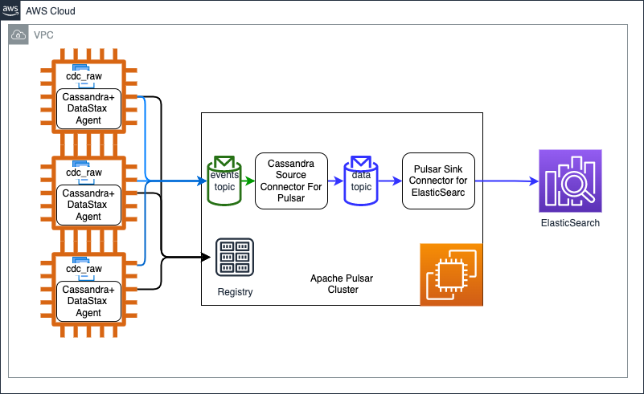

# Overview
Change Data Capture (CDC) determines and tracks changes on source Cassandra tables and pushes those changes to a message buffer in chronological order. You can consume those changes in real time and replicate them to another data store.
Apache Cassandra 3.11+ and Apache Cassandra 4.0+ support CDC configuration for a table. Cassandra 4.0 supports near real time CDC  that replicates data as soon as they are synced on disk.
Thhis page describes, how you can capture changes done to Cassandra database and capture those changes to a message buffer which in this case is Apache Pulsar cluster. Once the changes are buffered in Pulsar , you can consume those changes in realtime using Pulsar connector framework. You can write these changes to another datastore through a Pulsar Sink Connector to achieve live replication. In this page we use  Apache Pulsar Sink Connector for ElasticSearch and sync data from Apache Cassandra to ElasticSearch. 

# Architectural Components
1. Apache Cassandra cluster. 
2. Apache Pulsar cluster.
2. DataStax Agent on each node of Cassandra that pushes CDC events to Apache Pulsar cluster. The agent is deployed on each Cassandra node and started in the Cassandra process as an agent. The agent will create a topic for each table which will look like events-keyspce.table.
3. Apache Pulsar source connector for Cassandra on Pulsar cluster. The source connector will listen to messages on events-keyspce.table and push CDC event with data to data-keyspace.table topic. Now this data can be consumed by downstream Pulsar consumes like Pulsar sink connectors. 
4. Down stream Pulsar data consumers. These could be Apache Pulsar Sink Connector  or Apache Spark Process with Hudi etc. In this instance we are using Apache Pulsar Sink Connector for ElasticSearch to replicate data to ElasticSearch. 

Refer to the diagram below -

# Pre-requisite
1. Apache Cassandra cluster is deployed and CDC is enabled on each node. Refer [Enabling Cassandra CDC](https://debezium.io/documentation/reference/stable/connectors/cassandra.html#setting-up-cassandra)
2. For the purpose of this demonstration we need Cassandra tables with CDC configuration enabled. Run [schema.sql](schema.sql) to create keyspace and table. 
3. The instructions below assumes that Pulsar cluster is created in the VPC of Apache Cassandra cluster. Nodes connect with each other using private IP address.  

#  Deployment
## 1. Deploy Apache Pulsar  Cluster
1. The steps below show the process for Single Node Apache Pulsar Cluster. Launch an EC2 node with Amazon Linux and execute the steps below on the node. 
2. Download the package and extract.
```shell
wget https://archive.apache.org/dist/pulsar/pulsar-2.9.1/apache-pulsar-2.9.1-bin.tar.gz
tar xvfz apache-pulsar-2.9.1-bin.tar.gz
cd apache-pulsar-2.9.1
export PULSAR_HOME=`pwd`
export PULSAR_NODE_PRIVATE_IP=<PULSAR_NODE_PRIVATE_IP>
```
3. Update `conf/standalone.conf` and change `advertisedAddress` to private IP of the ndoe.
   ```shell
   advertisedAddress=<PULSAR_NODE_PRIVATE_IP>
   ````
4. Start node in standalone mode.
```shell
nohup ${PULSAR_HOME}/bin/pulsar standalone &
```
## 2. DataStax Agent Deployment on each Cassandra Node
### Cassandra 4
1. The instructions below work for Cassandra cluster installed from Datastax Cassandra Marketplace configuration. Refer [Cassandra4 Cluster Installation](cassandra-cdc/datastax-cdc-pulsar/pulsar-cluster/cassandra4-deployment.md). 
2. Run the steps below on each of the Cassandra node.
3. SSH to Cassandra node and execute following. Use the Private IP address of Apache Pulsar node created above. 
```shell
export PULSAR_URL=pulsar://${PULSAR_NODE_PRIVATE_IP}:6650
mdkir cassandra-agent
cd cassandra-agent
wget https://downloads.datastax.com/cdc-apache-cassandra/cassandra-source-agents-1.0.1.tar
tar -xvf cassandra-source-agents-1.0.1.tar
cd cassandra-source-agents-1.0.1/
AGENT_LIB_PATH=`pwd`/agent-c4-pulsar-1.0.1-all.jar
PULSAR_CONFIG=pulsarServiceUrl=$PULSAR_URL
AGENT_CONFIG="-javaagent:$AGENT_LIB_PATH=$PULSAR_CONFIG"
```
4. Create cassandra.service file to add agent configuration.
```shell
cat << EOF > cassandra.service.pulsaragent
[Unit]
Description=Cassandra Service

[Service]
Environment=JVM_EXTRA_OPTS="$AGENT_CONFIG"
Type=simple
PIDFile=/usr/share/oss/PID

ExecStartPre=/sbin/swapoff -a
ExecStart=/usr/share/oss/bin/cassandra  -p /usr/share/oss/PID

WorkingDirectory=/usr/share/oss
Restart=no
TimeoutStopSec=60
TimeoutStartSec=120
User=cassandra

[Install]
WantedBy=multi-user.target
EOF
```
5. Copy new cassandra.service file to home directory and system services.
```shell
cp $HOME/cassandra.service $HOME/cassandra.service.bak
cp cassandra.service.pulsaragent $HOME/cassandra.service
sudo cp $HOME/cassandra.service /etc/systemd/system/cassandra.service
```
6. Create data directory which the agent uses and add permissions.
```shell
sudo mkdir -p /usr/share/oss/bin/../data/cdc
sudo chown cassandra /usr/share/oss/bin/../data/cdc
sudo systemctl daemon-reload
```
7. Restart Cassandra
```shell
sudo service cassandra stop
sudo service cassandra start
```
8. Verify that Agent is stared.
```shell
grep -i agent /var/log/cassandra/system.log
### See a log statement like following 
### INFO  [main] 2022-02-16 15:44:58,913 Agent.java:92 - CDC agent started
```
## 3. Apache Pulsar Source Connector
1. Connect to Apache Pulsar node and execute commands below. 
2. Check if events topic is created. 
```shell
cd apache-pulsar-2.9.1
export PULSAR_HOME=`pwd`
$PULSAR_HOME/bin/pulsar-admin topics list public/default
```
3. Download Source Connector on Apache Pulsar node.
```shell
mkdir -p $HOME/cassandra-source-connector
cd $HOME/cassandra-source-connector
wget https://downloads.datastax.com/cdc-apache-cassandra/cassandra-source-connectors-1.0.1.tar
tar -xvf cassandra-source-connectors-1.0.1.tar

```
4. Create Cassandra Source Connector
```shell

export KEYSPACE=pocdb1
$PULSAR_HOME/bin/pulsar-admin source delete --name cassandra-customers-pocdb1  
$PULSAR_HOME/bin/pulsar-admin source create \
--name cassandra-customers-pocdb1 \
--archive $HOME/cassandra-source-connector/cassandra-source-connectors-1.0.1/pulsar-cassandra-source-1.0.1.nar \
--tenant public \
--namespace default \
--destination-topic-name public/default/data-pocdb1.customers \
--parallelism 1 \
--source-config '{
             "events.topic": "persistent://public/default/events-pocdb1.customers",
             "keyspace": "pocdb1",
             "table": "customers",
             "contactPoints": "10.0.131.64",
             "port": 9042,
             "loadBalancing.localDc": "OSS-dc0",
             "auth.provider": "PLAIN",
             "auth.username": "cassandra",
             "auth.password": "cassandra"
}'

$PULSAR_HOME/bin/pulsar-admin source status --name cassandra-customers-pocdb1
tail -f $PULSAR_HOME/logs/functions/public/default/cassandra-customers-pocdb1/cassandra-customers-pocdb1-0.log
```
5. Check if data topic is created and data is being pushed to the topic. 
```shell
$PULSAR_HOME/bin/pulsar-admin topics list public/default

$PULSAR_HOME/bin/pulsar-client consume persistent://public/default/data-pocdb1.customers -s "subscription"

```
## 4. ElasticSearch Sink creation
1. Refer to steps below to deploy single node ElasticSearch and ElasticSearch sink connect to push CDC data to ElasticSearch. 
###  4.1 Deploy Elastic Search Cluster
1. The steps below deploy a single node cluster using docker.
2. Create an Amazon Linux 2 EC2 instance and SSH to it. Use the steps below to deploy and install Docker.
```shell
sudo yum update -y
sudo amazon-linux-extras install docker
sudo service docker start
sudo systemctl enable docker
sudo usermod -a -G docker ec2-user
```
3. Reboot the node and SSH back in.
```shell
docker run -d -p 9200:9200 -p 9300:9300     -e "discovery.type=single-node"     docker.elastic.co/elasticsearch/elasticsearch:7.13.3

curl -s http://localhost:9200 
```
### 4.2  Create Apache Pulsar Elastic Search Sink Connector
1. SSH to Apache Pulsar node and download ElasticSearch sink connector .
```shell

mkdir $HOME/pulsar-sink-es
cd $HOME/pulsar-sink-es/
curl "https://dlcdn.apache.org/pulsar/pulsar-2.9.1/connectors/pulsar-io-elastic-search-2.9.1.nar" -o pulsar-io-elastic-search-2.9.1.
nar
ES_SINK_PATH=`pwd`/pulsar-io-elastic-search-2.9.1.nar
echo $ES_SINK_PATH
export ES_NODE_PRIVATE_IP=<ES_NODE_PRIVATE_IP>
```
2. Create Elastic Search Sink Connector
```shell

ES_URL=http://${ES_NODE_PRIVATE_IP}:9200
cd $HOME/apache-pulsar-2.9.1/
export PULSAR_HOME=`pwd`
${PULSAR_HOME}/bin/pulsar-admin sink delete --name es-sink-pocdb-customers  
${PULSAR_HOME}/bin/pulsar-admin sink create \
--archive $ES_SINK_PATH \
--tenant public \
--namespace default \
--name es-sink-pocdb-customers \
--inputs "persistent://public/default/data-pocdb.customers" \
--subs-position Earliest \
--sink-config "{
         \"elasticSearchUrl\":\"$ES_URL\",
          \"indexName\":\"pocdb.customers\",
         \"keyIgnore\":\"false\",
         \"schemaEnable\":\"true\"
}"
${PULSAR_HOME}/bin/pulsar-admin sink status --name es-sink-pocdb-customers
```

## 5 Test the solution end to end
1. Run sample program to insert data in Cassandra pocdb1.customers table.
2. SSH to Cassandra node and validate that CDC logs are created and consumed
```shell
## SSH to Cassandra node and run
 watch -n 1 ls /var/lib/cassandra/cdc_raw/
### You should see CommitLog files for brief period before they are consumed. 
```
3. SSH to Apache Pulsar node and validate that CDC events are pushed to Apache Pulsar events topic and that Cassandra Source Connector is pushing data to data topic.
```shell
### SSH to Apache Pulsar Node
${PULSAR_HOME}/bin/pulsar-client consume events-pocdb.customers -s "events-subscription"  -n 10

${PULSAR_HOME}/bin/pulsar-client consume data-pocdb.customers -s "data-subscription"  -n 10

```
4. Validate that ES sink connector is pushing data to ES.
```shell
## ec2-3-87-65-10.compute-1.amazonaws.com is the node where ES is installed
curl http://${ES_NODE_PRIVATE_IP}:9200/pocdb.customers/_search?q=<query-text>

http://${ES_NODE_PRIVATE_IP}:9200/pocdb.customers/_search?q=gmail.updated
```
